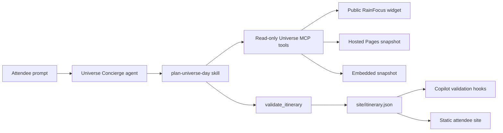

# Universe Concierge

Universe Concierge is a complete GitHub Copilot Agent Plugins 1.0 example that
turns an attendee's interests into a sourced, conflict-free GitHub Universe
itinerary and updates a tiny site in the repository.

**Prompts provide intent, skills provide procedure, MCP provides facts, hooks
provide guarantees, custom agents provide a role, and plugins package it all.**

The demo is designed for a 15-minute GitHub Universe walkthrough: ask the
concierge for a personalized day, watch it search the public catalog, preserve a
real break, validate the plan, and render the result as an attendee flight plan.

## What ships

| Part | Responsibility | Location |
| --- | --- | --- |
| Plugin | Packages every component with the Agent Plugins 1.0 schema | `plugins/universe-concierge/plugin.json` |
| Custom agent | Defines the concierge role and an explicit tool allow-list | `plugins/universe-concierge/com.github.copilot/agents/` |
| Skill | Owns the repeatable planning procedure | `plugins/universe-concierge/skills/plan-universe-day/` |
| MCP server | Exposes read-only event, session, venue, and validation tools | `plugins/universe-concierge/mcp.json` |
| Hook | Restricts writes to the itinerary, rejects invalid edits, and blocks completion while it is invalid | `plugins/universe-concierge/com.github.copilot/hooks/` |
| Marketplace | Publishes the plugin from this repository | `.github/plugin/marketplace.json` |
| Repository activation | Enables the same-repository marketplace for Copilot cloud agent | `.github/copilot/settings.json` |
| Demo site | Renders `site/itinerary.json` as an accessible flight-strip board | `site/` |

## Five-minute local smoke test

Requires Node.js 20 or later.

```bash
git clone https://github.com/srt32/universe-concierge.git
cd universe-concierge
npm ci
npm run check
UNIVERSE_SOURCE=embedded-snapshot npm run inspect:mcp
npm run preview
```

Open http://127.0.0.1:4173. The MCP inspection invokes all five tools against
the deterministic embedded snapshot. Run `npm run inspect:mcp` without
`UNIVERSE_SOURCE` to attempt the live public catalog first.

## Try the plugin in Copilot CLI

Build the self-contained MCP bundle before installing:

```bash
npm ci
npm run build
copilot plugin marketplace add .
copilot plugin install universe-concierge@universe-demo
copilot
```

Inside the interactive CLI:

```text
/plugin list
/agent
/skills list
/mcp
```

Select `universe-concierge`, then use:

```text
Plan my GitHub Universe day for October 28. I care about Copilot agents,
context engineering, and practical developer productivity. Keep a full break
from 12:10 to 1:10, allow time to move between buildings, and update the demo
site. Use public sources only and tell me if the data is a fallback.
```

The agent updates only `site/itinerary.json`. A fail-closed pre-tool hook denies
other write targets, the post-tool hook turns an invalid itinerary edit into a
failed tool result, and the agent-stop hook prevents completion while a present
or explicitly configured itinerary is invalid. A missing implicit itinerary is
ignored so the plugin does not block unrelated worktrees. The guarantee rejects
overlaps, missing canonical IDs or sources, missing requested breaks,
out-of-order or cross-day items, non-HTTPS source links, mismatched source
metadata, and snapshot data labeled as live. Breaks are evaluated in the event
timezone. Public catalog text is labeled as untrusted data so session content
cannot redefine the agent's instructions.

## Public data with explicit fallback

The MCP server uses this source chain:

1. Discover the unauthenticated RainFocus catalog widget from the public page,
   then page its backing public search endpoint.
2. Fetch the hosted snapshot from
   https://srt32.github.io/universe-concierge/data/sessions.json.
3. Read the embedded 16-session snapshot in the plugin.

Every result returns `source`, `sourceUrl`, and `retrievedAt`. Snapshot results
also report age and staleness. Failures from earlier adapters are retained in
`metadata.failures`; fallback data is never labeled live.

The implementation does not use attendee authentication, personal agendas, or
secrets. It does not call the denied RainFocus session dump endpoint. See
`docs/DATA_SOURCES.md` for the verified public boundary.

`site/itinerary.json` is a public artifact. Generated plans are anonymous by
default: the committed attendee label is `Universe attendee`, interests use a
small allow-list of broad topic labels, and non-session items contain no
free-form text. Optional metadata prose and validation messages are omitted from
anonymous artifacts. A personalized display label is allowed only when the user
explicitly requests a shareable public microsite and the file records
`publication.mode: "public-opt-in"` with `publicSharingConsent: true`. The
schema, build, hook, and browser renderer all enforce this contract. See
`SECURITY.md` for the safe-publication boundary.

For a consumer-repository demo such as `srt32/my-universe`, the attendee can
explicitly opt in to a shareable microsite using a public nickname and broad
interests. The opt-in is recorded in the JSON; the agent never treats ordinary
personalization as publication consent.

## MCP tools

| Tool | Result |
| --- | --- |
| `get_event_overview` | Event dates, venue, and source freshness |
| `search_sessions` | Public sessions matched across title, abstract, topics, speakers, room, and format |
| `get_session` | One canonical session by public ID |
| `get_venue_tips` | Public venue logistics without attendee data |
| `validate_itinerary` | Deterministic overlap, provenance, ID, time, and break checks |

The server uses the official MCP SDK and is bundled at build time so plugin
installation does not depend on an undocumented `npm install` lifecycle.

## Architecture



The portable Agent Plugins 1.0 components are `plugin.json`, `mcp.json`, and
`skills/`. GitHub Copilot-specific agents and hooks live under
`com.github.copilot/`. Cloud agent consumes MCP tools; this plugin does not rely
on MCP resources or prompts, and it does not use remote OAuth MCP.

CCA can use web search and web fetch, and the GitHub MCP server can expose the
`web_search` toolset. Playwright MCP is enabled by default in CCA, but GitHub's
default instance is scoped to localhost and `127.0.0.1`; external RainFocus
browser testing requires an explicitly configured external origin. The
concierge itself does not claim either capability is absent.

## Repository activation

`.github/copilot/settings.json` uses the required same-repository shape:

```json
{
  "extraKnownMarketplaces": {
    "universe-demo": {
      "source": {
        "source": "github",
        "repo": "srt32/universe-concierge"
      }
    }
  },
  "enabledPlugins": {
    "universe-concierge@universe-demo": true
  }
}
```

Copilot cloud agent can exercise this activation after the plugin is present on
the repository's default branch.

## Documentation

- Full verification ladder and troubleshooting: `TESTING.md`
- Component boundaries and runtime flow: `docs/ARCHITECTURE.md`
- Timed 15-minute presenter script: `docs/DEMO.md`
- Public-source evidence and fallback policy: `docs/DATA_SOURCES.md`

Agent Plugins specification and schemas:

https://github.com/agentplugins/agent-plugins-spec

GitHub Copilot plugin documentation:

https://docs.github.com/en/copilot/how-tos/copilot-cli/customize-copilot/plugins-creating

GitHub Copilot hooks reference:

https://docs.github.com/en/copilot/reference/hooks-reference

## License

MIT. See `LICENSE`.
